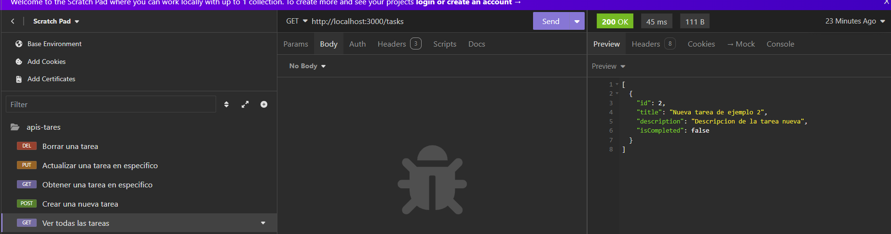
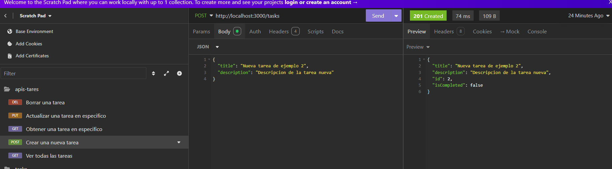
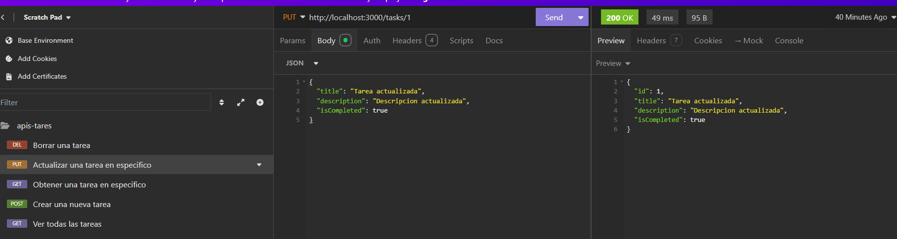

# Task Manager Backend

Este es un backend API RESTful para una aplicación de gestión de tareas, desarrollado con NestJS, TypeORM y MySQL.

## Características

- CRUD completo para tareas (Crear, Leer, Actualizar, Eliminar)
- Persistencia de datos con MySQL
- Arquitectura modular usando NestJS
- Tipado estático con TypeScript

## Requisitos previos

- Node.js (v14 o superior)
- MySQL

## Instalación

1. Clona el repositorio:
2. Instala las dependencias:
Excelente pregunta. Un buen README es esencial para cualquier proyecto en GitHub, ya que proporciona información importante sobre tu proyecto a otros desarrolladores o usuarios potenciales. Aquí te doy una estructura sugerida para tu README.md, específicamente para tu proyecto de backend de gestión de tareas:
markdownCopy# Task Manager Backend

Este es un backend API RESTful para una aplicación de gestión de tareas, desarrollado con NestJS, TypeORM y MySQL.

## Características

- CRUD completo para tareas (Crear, Leer, Actualizar, Eliminar)
- Persistencia de datos con MySQL
- Arquitectura modular usando NestJS
- Tipado estático con TypeScript

## Requisitos previos

- Node.js (v14 o superior)
- MySQL

## Instalación

1. Clona el repositorio:
git clone https://github.com/tu-usuario/task-manager-backend.git
Copy
2. Instala las dependencias:
cd task-manager-backend
npm install
Copy
3. Crea un archivo `.env` en la raíz del proyecto y añade las siguientes variables:
DB_HOST=localhost
DB_PORT=3306
DB_USERNAME=tu_usuario
DB_PASSWORD=tu_contraseña
DB_DATABASE=task_manager

4. Inicia la aplicación:

## Uso

La API estará disponible en `http://localhost:3000`. Puedes usar las siguientes rutas:

- `GET /tasks`: Obtener todas las tareas
- `GET /tasks/:id`: Obtener una tarea específica
- `POST /tasks`: Crear una nueva tarea
- `PUT /tasks/:id`: Actualizar una tarea existente
- `DELETE /tasks/:id`: Eliminar una tarea

## Desarrollo

Para ejecutar las pruebas:

## Despliegue

Este proyecto está configurado para ser desplegado en Heroku. Sigue estos pasos para desplegar:

1. Crea una aplicación en Heroku
2. Configura las variables de entorno en Heroku
3. Conecta tu repositorio de GitHub a Heroku
4. Despliega la rama main

## Contribuir

Las contribuciones son bienvenidas. Por favor, abre un issue primero para discutir lo que te gustaría cambiar.

## Licencia

[MIT](https://choosealicense.com/licenses/mit/)

